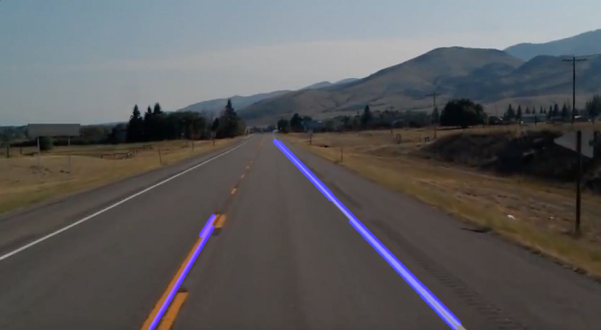

# Detect Lane Markings using OpenCV

Finding road markings is the first step toward building a self-driving car. If a camera sensor
can detect road markings correctly, it can follow the lanes and drive safely.

The main steps for detecting road markings are as follows:
``` 
1. Loading the image using OpenCV
2. Converting the image into grayscale
3. Smoothing the image
4. Canny edge detection
5. Masking the region of interest in an image
6. Applying bitwise_and
7. Implementing the Hough transform
8. Optimizing the detected road markings
9. Detecting road markings in an image
```

## Input Image


## Result Image

